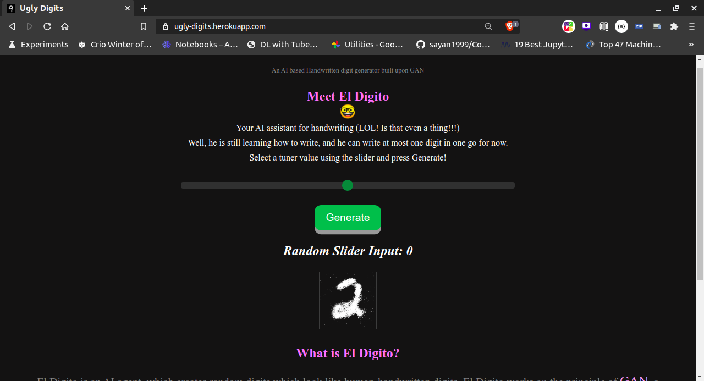
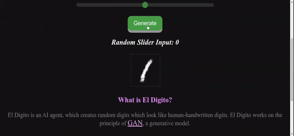

# Handwritten-Digit-Generator-GAN
## An AI based Handwritten digit generator built upon GAN
Well, it is still learning how to write, and he can write at most one digit in one go for now.

## Website [Here](https://ugly-digits.herokuapp.com/)!

[](https://ugly-digits.herokuapp.com/)

## Demo! 




## How it works?

This model creates random digits which look like human-handwritten digits. It works on the principle of GAN, a generative model.

## Dependencies

```
python3 -m pip install tensorflow
```

## How to run?

### 1. Training: 

```
cd Trainer && ipython3 Py_SimpleGan_Train.ipynb
```

### 2. Testing and convert tensorflow model to tensorflowjs weights: 

```
cd Trainer && ipython3 Py_SimpleGan_Test.ipynb
```

### 3. Start frontend: 
```
cd Server
npm install
npm start_time
```

### 4. Open your browser at http://localhost:3000/ and expect a page like [this](https://ugly-digits.herokuapp.com/).
